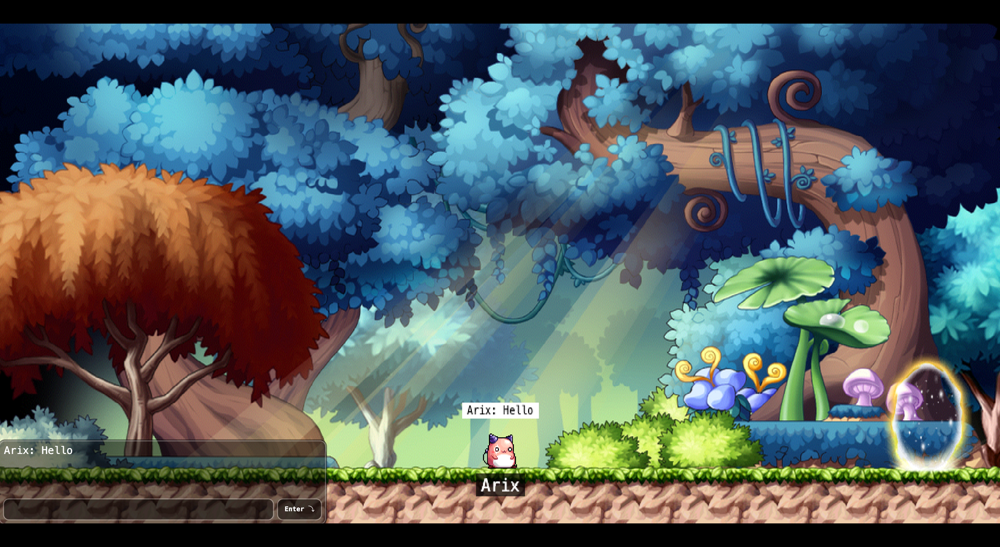

# what-am-i-doing-here-ts



A TypeScript-based multiplayer game with a MapleStory-inspired aesthetic. This project features a client-server architecture, real-time chat, and interactive environments.

---

## Table of Contents
- [what-am-i-doing-here-ts](#what-am-i-doing-here-ts)
  - [Table of Contents](#table-of-contents)
  - [Features](#features)
  - [Project Structure](#project-structure)
  - [Getting Started](#getting-started)
    - [Prerequisites](#prerequisites)
    - [Install Dependencies](#install-dependencies)
    - [Run the Client](#run-the-client)
    - [Run the Server](#run-the-server)
  - [Development](#development)
  - [Assets](#assets)
  - [License](#license)

---

## Features
- Multiplayer support with real-time chat
- Beautiful 2D environments and character sprites from Maplestory
- Scene management (maps, loader, login, etc.)
- Sound and music assets
- Modular TypeScript codebase

---

## Project Structure

```
client/           # Frontend (Vite, TypeScript, Tailwind)
  src/
    assets/       # Backgrounds, sprites, sounds, HTML UI
    scene/        # Game scenes (maps, loader, login, etc.)
    utils/        # Utility functions and constants
  public/         # Static assets
  ...             # Config and entry files

server/           # Backend (TypeScript, game logic, sockets)
  src/
    utils/        # Server utilities and constants
    @types/       # Shared type definitions
  public/         # Static server assets
  ...             # Config files

LICENSE, README.md, package.json
```

---

## Getting Started

### Prerequisites
- Node.js (v16+ recommended)
- npm or yarn

### Install Dependencies
```bash
cd client
npm install
cd ../server
npm install
```

### Run the Client
```bash
cd client
npm run dev
```

### Run the Server
```bash
cd server
npm run dev
```

---

## Development
- **Client**: Built with Vite, TypeScript, and Tailwind CSS.
- **Server**: TypeScript-based, handles game logic and socket communication.
- **Assets**: All game assets (backgrounds, sprites, sounds) are in `client/src/assets/`.

---

## Assets
- **Backgrounds**: `client/src/assets/backgrounds/`
- **Sprites**: `client/src/assets/sprites/`
- **Sounds**: `client/src/assets/sounds/`
- **HTML UI**: `client/src/assets/html/`

---

## License
See [LICENSE](LICENSE) for details.
